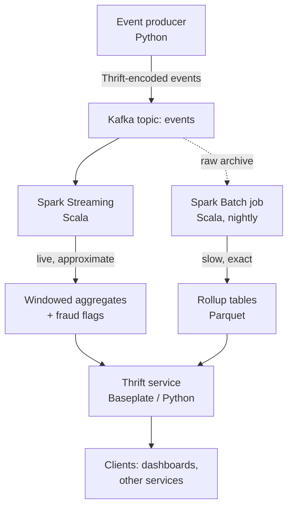
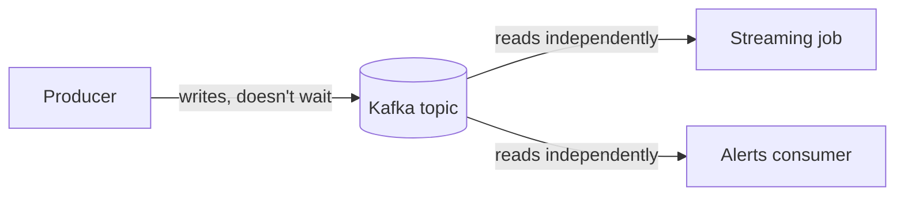
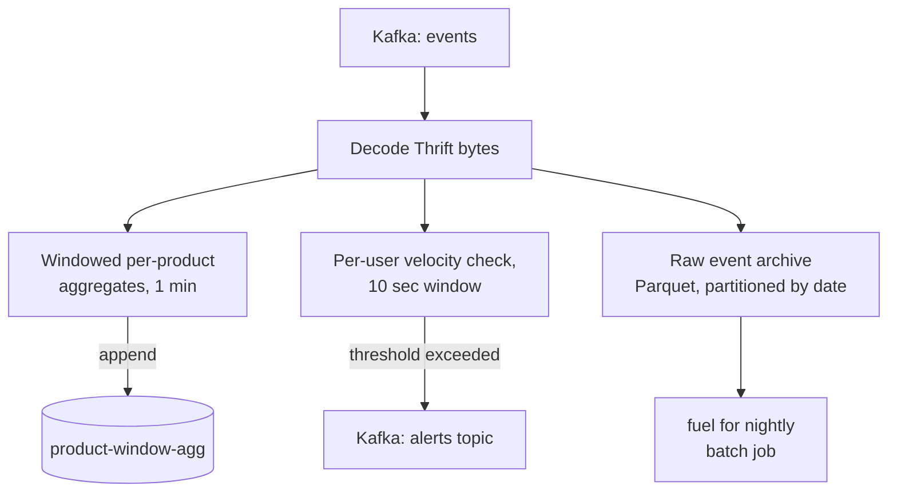
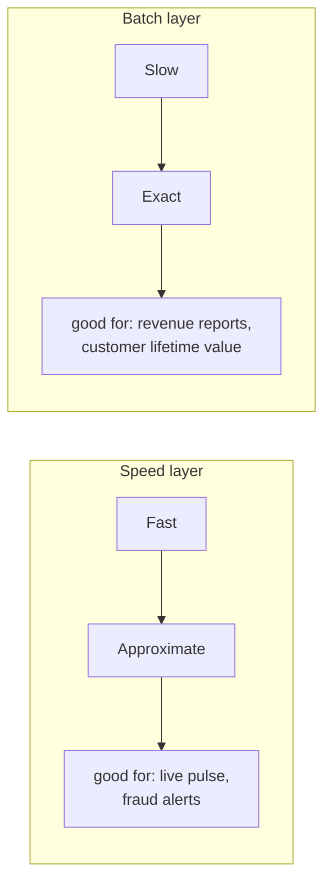
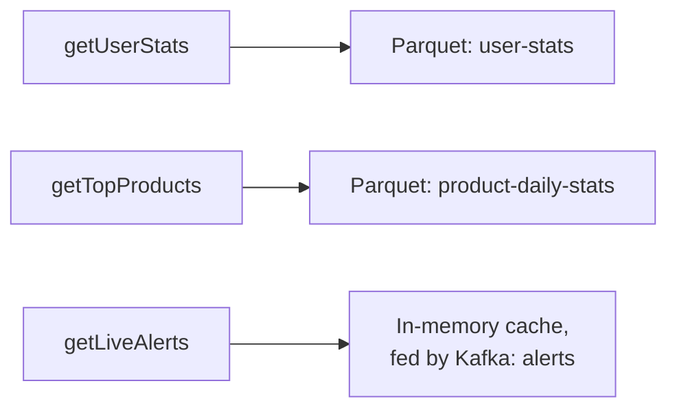
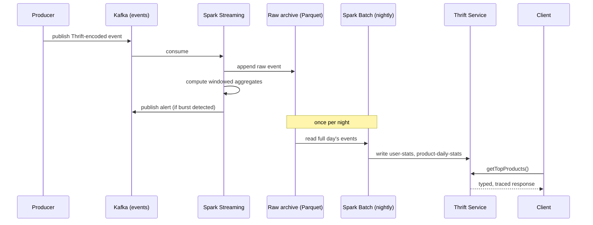

## The problem

Picture an ordinary e-commerce site. Every second, users are viewing products, clicking around, adding things to carts, and occasionally buying. Individually, each of those actions is trivial — a row of data, a timestamp, a user ID. Collectively, they're the raw material for almost everything a business wants to know about itself.

But turning that raw stream of clicks into something useful runs into three problems at once, not one:

1. **You need answers *now***, for things like fraud detection — a bot hammering the checkout endpoint fifty times a second needs to be caught in seconds, not the next morning.
2. **You need answers that are *correct*, eventually** — a customer's lifetime value, or which products actually sold best last quarter, is a number people will make budget decisions on. It has to be right, even if that means it can't be instant.
3. **You need to expose both** of those answers to other systems — a dashboard, a website, another team's service — through something more disciplined than "query my database directly and hope I never rename a column."

Most tutorials solve exactly one of these three problems and call it a day. Solving all three *together*, without one compromising the other, is the actual system design problem — and it's what this project is built around.

## The shape of the solution

The instinct might be to reach for one big system that does everything. That's usually a mistake. Fast and correct are frequently in tension: the things that make a system fast (approximate windows, in-memory state, "close enough" cutoffs) are the same things that make it slightly wrong at the edges. So instead of one system, this project uses two paths that deliberately disagree with each other for a while, and a serving layer that's honest about which one it's giving you.



This is a **lambda architecture**: a fast "speed layer" that gives you a live, slightly-approximate pulse, and a slow "batch layer" that periodically recomputes the exact truth from the immutable raw data. The serving layer sits on top of both and hands out whichever one the caller actually needs.

Every component in this system exists to answer one rhetorical question: *why not just do this the simple way?* Below, stage by stage, is the honest answer.

## Stage 1: the producer — why generate fake events at all?

The producer is a small Python script that simulates a clickstream: views, clicks, add-to-carts, and purchases, weighted so the funnel narrows realistically (most people view, few people buy). Occasionally it also fires a *burst* of rapid events from one user, on purpose — because a system that only ever sees well-behaved traffic never proves its fraud detection actually works.

It doesn't send raw JSON. Every event is serialized as a Thrift struct before it touches the network, for reasons the next section covers.

## Stage 2: Kafka — why not call the downstream service directly?

**The rhetorical question:** if the producer just wants Spark to process events, why not have the producer call Spark directly, or write straight into a database?

**The answer:** because that would couple the producer's uptime to the consumer's uptime. If Spark is mid-restart, or scaling up, or simply slower than the producer for a minute, a direct call either blocks the producer or drops the event. Neither is acceptable.

Kafka decouples the two sides completely. The producer writes to a topic and moves on — it doesn't know or care who, if anyone, is reading. On the other side, the streaming job reads at its own pace, and if it crashes and restarts, it resumes exactly where it left off instead of losing data. It also means multiple independent consumers can read the *same* stream without knowing about each other — in this system, the streaming job and the alerts cache both read from Kafka topics without any coordination between them.



The tradeoff: you now have an extra moving part to operate (a Kafka cluster) instead of a direct call. For a system where uptime and replayability matter, that's a trade worth making.

## Stage 3: Thrift — why not just use JSON?

**The rhetorical question:** JSON is human-readable and needs no schema — why add a compiler step and a `.thrift` file just to describe an event?

**The answer:** because "needs no schema" is precisely the problem. Nothing stops the Python producer from silently renaming a field, or dropping one, and nothing tells the Scala consumer until it's already getting `null`s or throwing exceptions at 2am.

Thrift makes you write the event's shape down once:

```thrift
struct Event {
  1: required string eventId,
  2: required string userId,
  3: required string productId,
  4: required EventType eventType,
  5: required i64 timestamp,
  6: optional double price,
  7: optional string sessionId
}
```

Both the Python producer and the Scala streaming job generate code from this *same file*. A change to the event shape is now a change to a shared contract that both sides have to acknowledge — not a runtime surprise discovered in production. As a side benefit, Thrift's compact binary encoding is also smaller and faster to parse than JSON.

The tradeoff: it's more setup than "just send JSON." You need a compiler step, and both languages need generated bindings kept in sync. For a project explicitly about contract safety between two different languages, that friction is the point, not a cost to minimize away.

## Stage 4: Spark Streaming in Scala — why not Python, and why not just wait for the batch job?

Two separate rhetorical questions live in this stage.

**"Why not just use PySpark, since the rest of the producer is Python anyway?"**

Spark itself is a JVM system written in Scala. PySpark works by having your Python code send instructions to a JVM process underneath it — for standard DataFrame operations (`groupBy`, `agg`, and so on) the performance is nearly identical, because Spark's execution engine does the actual work either way. The cost shows up specifically when you need **custom per-row logic**, which this job does: decoding Thrift-compact bytes for every single event. In PySpark, that means serializing data across the Python/JVM boundary for every row. In Scala, that decoding happens *inside* the same JVM Spark is already running in — no boundary to cross. At small scale it's a rounding error; at real event volume, it's the difference between a job that keeps up and one that quietly falls behind.

**"Why compute anything in real time at all, if the nightly batch job is going to recompute it properly anyway?"**

Because "properly" takes hours you don't have if you're trying to catch fraud while it's happening. The streaming job groups events into short time windows and watches for anomalies — specifically, a burst of many events from one user in a ten-second window, which is exactly what the producer's occasional burst-injection is designed to trigger.



This view is deliberately approximate. Structured Streaming uses *watermarks* — a rule for how long to wait for late-arriving events before finalizing a window. Wait too long and your "live" numbers aren't live anymore; cut off too early and you risk quietly missing a straggling event. That's an acceptable trade for "what's happening right now" — and an unacceptable one for "what this customer's account is actually worth," which is exactly why there's a second path.

## Stage 5: the nightly batch job — why recompute anything, if the streaming job already did?

**The rhetorical question:** isn't this just doing the same work twice?

**The answer:** no — it's doing work the streaming job structurally *cannot* do. The streaming job has to make a timing decision (how long to wait for late data) that trades accuracy for speed. The batch job has no such constraint. Once a day, it rereads *every* raw event for that day — the same raw-event archive the streaming job quietly wrote to Parquet — with no watermark, no window cutoff, and no time pressure, and computes the numbers that are simply correct.



This is the batch view in the lambda architecture: it doesn't replace the streaming numbers, it *reconciles* them. A dashboard showing "purchases in the last hour" reads from the speed layer and accepts some fuzziness. A finance report showing "yesterday's exact revenue" reads from the batch layer once it's landed, and doesn't.

The tradeoff: you now maintain two computation paths for overlapping logic instead of one. That's real complexity — and it's the correct amount of complexity for a system that has to be both fast *and* right, because no single path can be both at once.

## Stage 6: the Baseplate/Thrift service — why not a simple REST API?

**The rhetorical question:** all this data ends up in Parquet files and a Kafka topic — why not just expose it with a small Flask app and call it done?

**The answer:** you could, but you'd be rebuilding, badly, everything Baseplate gives you for free. Every RPC through this service automatically gets a distributed trace span, request-latency and error-rate metrics, and structured logging tied to that request — without the handler code containing a single line about any of it.

```thrift
service AnalyticsService {
  UserStats getUserStats(1: string userId) throws (1: NotFoundException e),
  list<ProductStats> getTopProducts(1: i32 limit, 2: string window),
  list<Alert> getLiveAlerts(1: i32 limit),
  bool isHealthy()
}
```

The handler itself only contains business logic — read the batch-computed Parquet rollups for historical queries, read the in-memory cache (kept warm by tailing the `alerts` Kafka topic) for live ones. Everything else — tracing, metrics, logging, connection handling — is Baseplate wrapping the Thrift processor.



And because the API is defined in the same Thrift IDL used everywhere else in the system, any client — in any language with Thrift bindings — gets a typed, generated client for free. No hand-written API docs to go stale.

## Putting the whole thing together



## What this project deliberately leaves out

No system design write-up is honest if it pretends every corner was handled. A few things were left simple on purpose, because the point of this project was the shape of the system, not its production hardening:

- **Storage is flat Parquet, read with pandas** — not a real OLTP/OLAP store. Swapping it for Postgres or a proper warehouse wouldn't change the shape of the Thrift handler at all, which is exactly why it was fine to defer.
- **No schema registry** — the Thrift IDL files are versioned by hand in git, which works at this scale but wouldn't at a larger one.
- **The service reloads its cache on a fixed TTL**, not on a push signal. At real scale, this would become a "batch job finished" event instead.
- **Single-broker Kafka, no auth or ACLs** — this is a local, runnable demo, not a deployment target.

## Closing thought

None of the four "expensive" choices in this system — Kafka, Thrift, Scala for the Spark jobs, and the batch/streaming split — exist because they're impressive. Each one exists because removing it lets a specific kind of bug happen silently: a dropped event, a schema mismatch discovered in production, a job that quietly falls behind, or a number that's wrong forever because nothing ever corrected it. That's the actual test for whether a piece of infrastructure earns its place in a system: not whether it's interesting, but what silently breaks the moment you take it out.