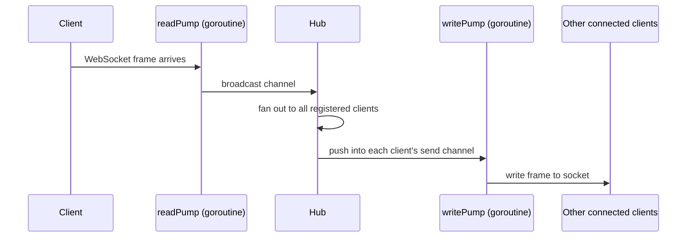
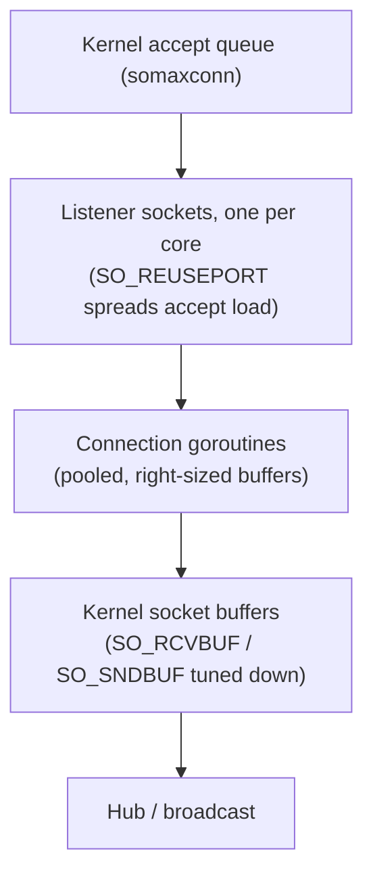
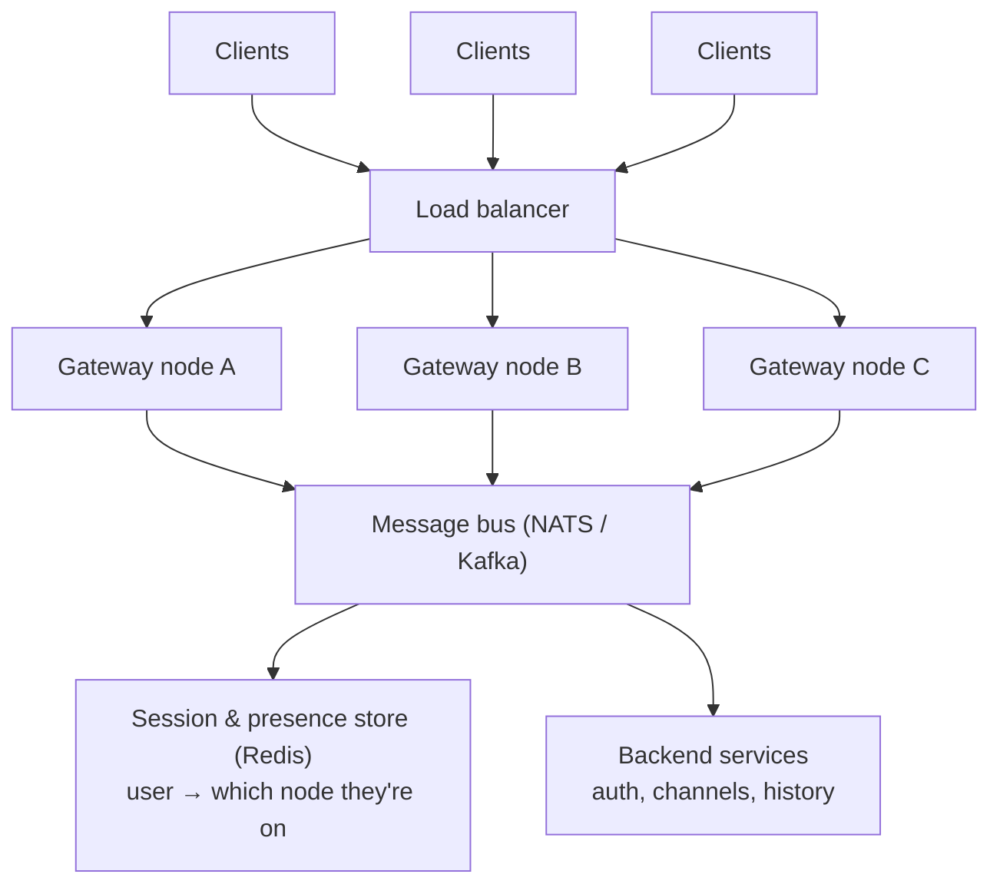

# What Does a Million WebSocket Connections Actually Cost?

A chat app with a hundred users doesn't need to think about this problem. A chat app with a hundred million users can't afford not to.

Every WebSocket connection a server holds open is, underneath the abstraction, two very physical things: a **file descriptor** the kernel is tracking, and a chunk of **memory** your application allocated to read from and write to it. Neither of those is free. Neither of those is infinite. And at the scale Slack operates at — millions of connections held open simultaneously, every one of them idle most of the time but ready to receive a message at any moment — the cost of a single connection, multiplied by a million, becomes the entire engineering problem.

So here's the question this project set out to actually answer, instead of taking on faith: **what does one connection cost, and where does that cost actually come from?**

To find out, I built a distributed WebSocket gateway from scratch in Go — no external libraries, hand-rolled protocol implementation, real load testing against it — specifically so nothing about the cost was hidden behind someone else's abstraction.

---

## The problem, stated precisely

Ask most engineers "can your server handle a million connections?" and you'll get a shrug. It's the wrong question. The right question is: **a million connections doing what?**

A connection that's actively streaming video costs something completely different from a connection that's open for six hours and sends one "you have a new message" event. Slack-style systems are almost entirely the second kind — huge numbers of mostly-idle connections, each one a promise that *when* something happens, it'll be delivered instantly.

That changes what you're optimizing for. You're not optimizing for throughput per connection. You're optimizing for:

- **Memory per idle connection** — because you're paying for it whether or not anything is happening
- **File descriptors per connection** — a hard OS-level ceiling, not a soft one
- **The cost of waking up and delivering to the right connection**, out of a million, the instant a message arrives

This is the C10K problem's bigger sibling — the C10M problem — and it's not solved by "add more servers" alone. Each individual server still needs to hold as many connections as it economically can, or you're just buying your way out of an inefficiency with hardware.

---

## Why build it, not just read about it

Reading that goroutines are "lightweight" doesn't tell you *how* lightweight, or lightweight compared to what, or what actually eats the memory if not the goroutines themselves. The only way to get a real, load-bearing intuition for this was to build the thing, instrument it, and watch the numbers move.

So: what actually happens, byte for byte, when a WebSocket connection opens?

---

## Building the protocol by hand

Most WebSocket servers are built on top of a library like `gorilla/websocket`, and for production code, that's the right call — don't reinvent a well-tested protocol implementation. But a library is also a black box between you and the actual cost you're trying to understand. So Phase 1 of this project implements [RFC 6455](https://datatracker.ietf.org/doc/html/rfc6455) directly against Go's standard library:

- The HTTP handshake, computed by hand: `base64(sha1(Sec-WebSocket-Key + magic GUID))`
- Frame parsing, including the masking XOR that every client-to-server frame is required to carry
- Ping/pong heartbeats, close frames, and the hijack step that pulls a raw TCP connection out from under Go's HTTP server

Once a connection is upgraded, the server needs somewhere to route its messages. That's the hub.



Every connection gets exactly two goroutines: one blocked on reading, one blocked on writing, connected to the rest of the system only through channels. The hub itself is the single owner of the connection registry — no mutexes, no shared-state locking, just one goroutine that's the only thing allowed to touch the map of connected clients. Everything else talks to it by sending values into channels.

That design is simple to reason about. It's also, as it turns out, not free — and measuring exactly *how not free* was the point.

---

## What the numbers actually said

Rather than guess, I built a load generator that ramps connections up in controlled batches and watches a `/stats` endpoint reporting live goroutine count and heap memory.

| Connections | Goroutines | Heap | Per connection |
|---|---|---|---|
| 500 | 1,004 (4 base + 2 per client) | 6.1 MB | ~12.3 KB |
| 4,000 | 8,004 | 49.8 MB | ~12.7 KB |
| 4,096+ | — | — | `accept4: too many open files` |

Two things jumped out immediately.

First, the goroutine count is *exactly* predictable — `4 + 2n`. That's a nice property: the model is simple enough to reason about with arithmetic, not profiling guesswork.

Second, and more interesting: most of that ~12KB per connection isn't the goroutines themselves. Go's goroutine stacks start at 2KB and only grow on demand — two of them is 4KB at most. The bigger cost is the **buffered reader and writer** that Go's HTTP hijack hands you by default, at 4KB each. Buffers you didn't explicitly ask for turned out to be a bigger line item than the concurrency primitive everyone worries about.

That's the kind of thing you only find by measuring.

---

## Hitting the wall on purpose

The most useful moment in this whole project was watching it actually break. Past a few thousand connections, the server started logging:

```
accept4: too many open files
```

That's not a bug. That's the file descriptor ceiling — a hard, physical OS limit — showing up exactly where the theory said it would. Seeing a real error message tied to a specific, predictable number is a different kind of understanding than reading that "file descriptors are limited."

---

## So how do you actually get to a million?

Getting one machine to hold a million connections means attacking both cost centers at once: application memory, and kernel-side resources.



- **Pool and shrink buffers.** `sync.Pool` instead of a fresh allocation per connection, and buffers sized for actual message sizes instead of the 4KB default.
- **Tune the kernel's per-socket buffers.** This one is easy to miss: Linux defaults often reserve 16–64KB *per direction, per socket* for TCP send/receive buffers. At a million connections that's potentially more memory than your entire application layer combined. For small, bursty chat-style messages, those get set explicitly smaller.
- **Spread accept load across cores** with `SO_REUSEPORT` — one listening socket per CPU core instead of a single accept loop being the bottleneck.
- **Raise the ceilings that were never meant to be hit** — `ulimit -n`, `fs.file-max`, `somaxconn`, `tcp_max_syn_backlog` — all tuned well past their conservative defaults.

None of this replaces the goroutine-per-connection model, interestingly. Go's own networking runtime already multiplexes blocked goroutines onto epoll under the hood, so a goroutine parked on `Read()` isn't burning an OS thread while it waits. The wins are in what surrounds each goroutine, not in replacing goroutines themselves.

---

## Beyond one box

One machine, however well tuned, still has a ceiling. The architecture that scales past it separates concerns cleanly: connection-holding is one job, message routing is a different job, and they shouldn't live on the same box once you're past what one box can hold.



- **Gateway nodes** do one job only: hold connections, handshake, heartbeat, relay. No business logic — that's what makes them cheap to scale horizontally.
- **The message bus** exists because a message published by a user on node A might need to reach a subscriber sitting on node B. Without it, fan-out only works within a single process.
- **The session/presence store** answers "which node is this user connected to right now" — needed for direct delivery and for other services to ask "is this user online" without knowing anything about WebSockets at all.

---

## What this project actually taught

Not "goroutines are cheap" — that's true but incomplete. The real lesson was narrower and more useful: **the expensive part of a WebSocket connection is rarely the part everyone worries about first.** Everyone reaches for "goroutines don't scale" as the worry. The buffers, the kernel socket memory, and the ephemeral port range turned out to matter just as much, if not more, and none of them show up unless you go looking.

That's the value of building the protocol by hand instead of trusting a library: the cost isn't hidden anymore. It's a number on a `/stats` endpoint, moving in real time as connections pile up.

---

**Repo:** [add your GitHub repo link here]

*Built as a self-directed learning project to develop real intuition for connection-scale systems — the kind of problem that sits underneath products like Slack, Discord, and any platform where "real-time" is a promise made to millions of open sockets at once.*